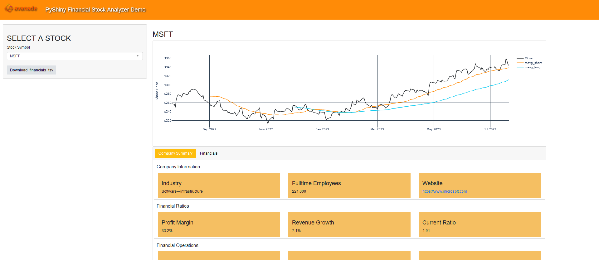
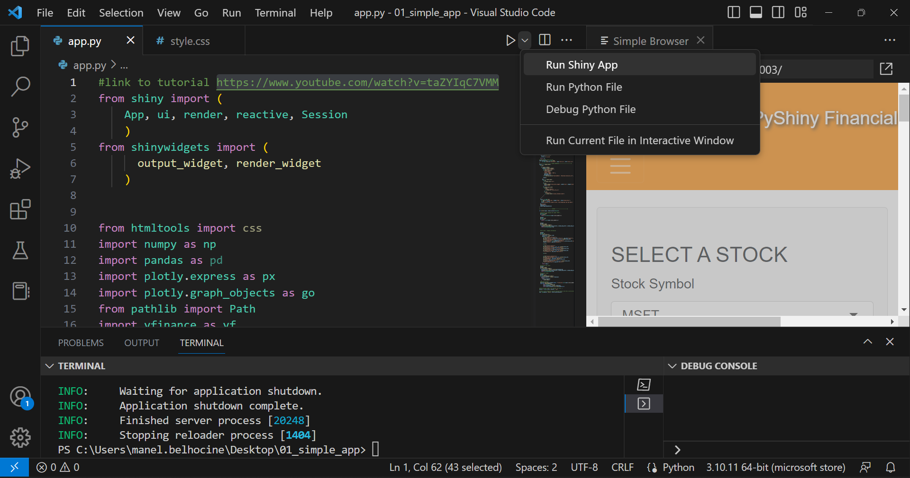

# PyShiny-DEMO
# Shiny Python Dashboard



The Shiny Python Dashboard is a web application built using Python and Shiny, This dashboard allows you to explore and visualize data in an intuitive and user-friendly way.

## Features

- Interactive charts and graphs
- Real-time data updates
- Customizable layout and design
- Easy-to-use interface

## Installation

To run the Shiny Python Dashboard on your local machine, please follow these steps:

1. Clone this repository to your preferred directory:

   ```bash
   git clone https://github.com/manelbelhocinepro/PyShiny-DEMO.git
   ```

2. Navigate to the project directory:

   ```bash
   cd PyShiny-DEMO
   ```

3. Set up a virtual environment (optional but recommended):

   ```bash
   python -m venv venv
   ```

4. Activate the virtual environment:

   - On Windows:

     ```bash
     venv\Scripts\activate
     ```

   - On macOS and Linux:

     ```bash
     source venv/bin/activate
     ```

5. Install the required dependencies from the `requirements.txt` file:

   ```bash
   pip install -r requirements.txt
   ```

6. Run the application:

   ```bash
   python app.py
   ```
   If you are using Visual Studio Code, you can click on the play button : Run Shiny App
   
   


8. Open your web browser and go to `http://localhost:XXXX` to access the Shiny Python Dashboard.

## Data

By default, the Shiny Python Dashboard uses yahoo API. If you want you can use your own data, simply place your data files in a `data` directory with your own CSV, Excel, or other compatible files. Make sure to update the data loading code in the `app.py` file accordingly.


## Link to tutorial

https://www.youtube.com/watch?v=taZYIqC7VMM
---

